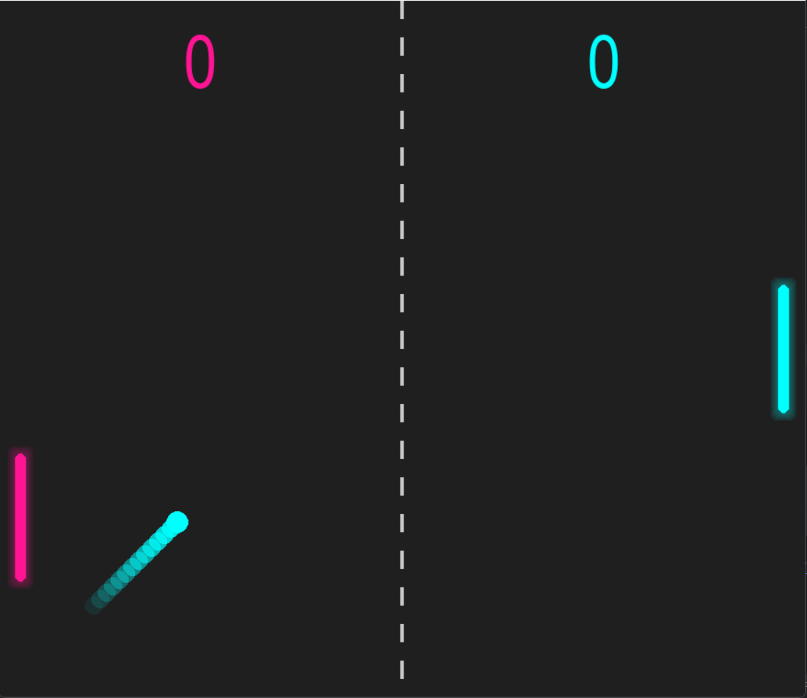

# NEON PONG – Steam Indie Style Pong Game

 <!-- Replace with your own screenshot -->

## Overview

NEON PONG is a modern, **Steam indie-styled version of the classic Pong game**, built with **Python and Pygame**, featuring neon visuals, glowing paddles, and a ball with a trailing effect.

Features include:

- Singleplayer mode against AI  
- Multiplayer mode for 2 players  
- Scoreboard and Game Over screen  
- Pause menu with Resume and Quit to Menu options  
- Neon glow and trail effects for ball and paddles  
- Interactive menu with intuitive UI  

---

## Installation

1. Clone the repository:

```bash
git clone https://github.com/yourusername/neon-pong.git
cd neon-pong